# 📄 Use Case: AI Assistant Chat

**Description:** Interact with AI for support and explanation

**Precondition:** User is authenticated and system is connected to AI API.

**Postcondition:** User receives helpful AI-generated explanation.

## 🧑‍🤝‍🧑 Actors
- **AI**
- **System**
- **User**

## 🗄️ Data Entities
- **AIResponse**
- **ChatHistory**

## 🔄 Flows
### ALT: ALT - Generation Error
1. **AI**: AI fails to generate a valid response
2. **System**: System informs user about the error and suggests retry

### MAIN: MAIN
1. **User**: User enters query (explain word/sentence/translate)
2. **System**: System sends context-aware prompt to AI API
3. **AI**: AI generates explanation/response
4. **System**: System displays AI response to user

## 📊 Sequence Diagram

```mermaid
sequenceDiagram
  autonumber
  participant AI
  participant System
  participant User
  rect rgb(30, 35, 40)
  Note right of AI: ALT: ALT - Generation Error
  AI->>+AI: AI fails to generate a valid response
  AI->>+System: System informs user about the error and suggests retry
  end
  rect rgb(30, 35, 40)
  Note right of AI: MAIN: MAIN
  AI->>+User: User enters query (explain word/sentence/translate)
  User->>+System: System sends context-aware prompt to AI API
  System->>+AI: AI generates explanation/response
  AI->>+System: System displays AI response to user
  end

```

## ⚖️ Business Rules
- AI context must be maintained based on current session
- AI response must be validated before display

