# 📄 Use Case: Play Learning Game

**Description:** User plays games to practice vocabulary: Multiple choice, Typing, Listening, Matching, or Mixed mode.

**Precondition:** User is authenticated and has at least one topic with vocabulary words.

**Postcondition:** Game session progress, user XP, and streak are updated in the database.

## 🧑‍🤝‍🧑 Actors
- **System**
- **User**

## 🗄️ Data Entities
- **UserProgress**
- **GameSession**
- **Word**

## 🔄 Flows
### ALT: User quits game
1. **User**: User clicks "Quit" button.
2. **System**: System displays session summary (score, XP gained).
3. **System**: System saves current progress of the game session.

### ALT: User selects wrong answer
1. **User**: User provides wrong answer.
2. **System**: System displays wrong answer feedback, correct answer, and explanation.
3. **System**: System updates progress (XP/streak impact).
4. **System**: System proceeds to next question.

### MAIN: MAIN
1. **User**: User selects game type (Multiple choice, Typing, Listening, Matching, or Mixed mode) and topic/word set.
2. **System**: System initializes game session and presents first question.
3. **User**: User provides answer.
4. **System**: System validates answer and provides immediate feedback.
5. **System**: If incorrect, System displays correct answer and explanation.
6. **System**: System updates XP/streak in UserProgress.
7. **System**: System displays next question or session summary.

## 📊 Sequence Diagram

```mermaid
sequenceDiagram
  autonumber
  participant User
  participant System
  rect rgb(30, 35, 40)
  Note right of User: ALT: User quits game
  User->>+User: User clicks "Quit" button.
  User->>+System: System displays session summary (score, XP gained).
  System->>+System: System saves current progress of the game session.
  end
  rect rgb(30, 35, 40)
  Note right of User: ALT: User selects wrong answer
  User->>+User: User provides wrong answer.
  User->>+System: System displays wrong answer feedback, correct answer, and explanation.
  System->>+System: System updates progress (XP/streak impact).
  System->>+System: System proceeds to next question.
  end
  rect rgb(30, 35, 40)
  Note right of User: MAIN: MAIN
  User->>+User: User selects game type (Multiple choice, Typing, Listening, Matching, or Mixed mode) and topic/word set.
  User->>+System: System initializes game session and presents first question.
  System->>+User: User provides answer.
  User->>+System: System validates answer and provides immediate feedback.
  System->>+System: If incorrect, System displays correct answer and explanation.
  System->>+System: System updates XP/streak in UserProgress.
  System->>+System: System displays next question or session summary.
  end

```

## ⚖️ Business Rules
- System must update progress, including XP and streak, after each question or at the end of the game session.
- System must display the correct answer and explanation if the user selects the wrong answer.
- System must provide immediate feedback for each question (correct/incorrect).
- User must select a topic or word set.
- User must select a game type.

