# 📄 Use Case: Perform Review Session

**Description:** Allow users to review words using Spaced Repetition System.

**Precondition:** User has learned words and some words are due for review.

**Postcondition:** User progress updated, review schedule adjusted, and review session completed.

## 🧑‍🤝‍🧑 Actors
- **System**
- **User**

## 🗄️ Data Entities
- **ReviewSession**
- **UserProgress**
- **Word**

## 🔄 Flows
### EXCEPTION: No Words Due
1. **User**: User initiates a review session.
2. **System**: System checks for words due for review.
3. **System**: System informs the user that there are no words to review at this time.

### MAIN: MAIN
1. **User**: User initiates a review session.
2. **System**: System fetches words due for review from the user's progress list.
3. **System**: System displays the word for review.
4. **User**: User attempts to recall the meaning and flips the card.
5. **User**: User marks the answer as 'Correct' or 'Incorrect'.
6. **System**: System updates the word's review status, interval, and next review date.
7. **System**: System displays next due word or session summary.

## 📊 Sequence Diagram

```mermaid
sequenceDiagram
  autonumber
  participant User
  participant System
  rect rgb(30, 35, 40)
  Note right of User: EXCEPTION: No Words Due
  User->>+User: User initiates a review session.
  User->>+System: System checks for words due for review.
  System->>+System: System informs the user that there are no words to review at this time.
  end
  rect rgb(30, 35, 40)
  Note right of User: MAIN: MAIN
  User->>+User: User initiates a review session.
  User->>+System: System fetches words due for review from the user's progress list.
  System->>+System: System displays the word for review.
  System->>+User: User attempts to recall the meaning and flips the card.
  User->>+User: User marks the answer as 'Correct' or 'Incorrect'.
  User->>+System: System updates the word's review status, interval, and next review date.
  System->>+System: System displays next due word or session summary.
  end

```

## ⚖️ Business Rules
- System must update progress, including XP and streak, after the review session.
- User can only review words that have been previously learned.
- System must prioritize words that are overdue for review.
- System must calculate next review time based on user performance (Spaced Repetition).

