# 📄 Use Case: Practice TOEIC Skill

**Description:** Practice specific TOEIC parts (Listening/Reading)

**Precondition:** User is authenticated.

**Postcondition:** User receives feedback and improves understanding of TOEIC format.

## 🧑‍🤝‍🧑 Actors
- **System**
- **User**

## 🗄️ Data Entities
- **UserProgress**
- **TOEICPart**
- **TOEICQuestion**

## 🔄 Flows
### ALT: ALT - Audio/Script Control
1. **User**: User toggles script display
2. **User**: User clicks replay audio

### MAIN: MAIN
1. **User**: User selects a TOEIC Part and skill
2. **System**: System loads corresponding question set
3. **User**: User answers the question(s)
4. **System**: System provides feedback and explanation if wrong

## 📊 Sequence Diagram

```mermaid
sequenceDiagram
  autonumber
  participant User
  participant System
  rect rgb(30, 35, 40)
  Note right of User: ALT: ALT - Audio/Script Control
  User->>+User: User toggles script display
  User->>+User: User clicks replay audio
  end
  rect rgb(30, 35, 40)
  Note right of User: MAIN: MAIN
  User->>+User: User selects a TOEIC Part and skill
  User->>+System: System loads corresponding question set
  System->>+User: User answers the question(s)
  User->>+System: System provides feedback and explanation if wrong
  end

```

## ⚖️ Business Rules
- Audio can be replayed
- User can toggle script display
- Immediate feedback required for practice mode
- TOEIC format must be simulated based on official standards

