# 📄 Use Case: Take TOEIC Test

**Description:** Simulate full or mini TOEIC test

**Precondition:** User is authenticated.

**Postcondition:** Test result is recorded and user can review performance.

## 🧑‍🤝‍🧑 Actors
- **System**
- **User**

## 🗄️ Data Entities
- **Score**
- **TOEICQuestion**
- **TestSession**

## 🔄 Flows
### EXCEPTION: EXCEPTION - Timeout
1. **System**: System detects timer reaches zero
2. **System**: System auto-submits current answers
3. **System**: System displays result and review

### MAIN: MAIN
1. **User**: User selects Mini or Full Test mode
2. **System**: System starts timer and loads test questions
3. **User**: User answers questions within the time limit
4. **System**: User submits test or System auto-submits on timeout
5. **System**: System calculates score and provides detailed review

## 📊 Sequence Diagram

```mermaid
sequenceDiagram
  autonumber
  participant System
  participant User
  rect rgb(30, 35, 40)
  Note right of System: EXCEPTION: EXCEPTION - Timeout
  System->>+System: System detects timer reaches zero
  System->>+System: System auto-submits current answers
  System->>+System: System displays result and review
  end
  rect rgb(30, 35, 40)
  Note right of System: MAIN: MAIN
  System->>+User: User selects Mini or Full Test mode
  User->>+System: System starts timer and loads test questions
  System->>+User: User answers questions within the time limit
  User->>+System: User submits test or System auto-submits on timeout
  System->>+System: System calculates score and provides detailed review
  end

```

## ⚖️ Business Rules
- Auto-submit required when timer expires
- No feedback displayed during test session
- Timer must be strictly enforced

