# 📄 Use Case: AI Topic Creation

**Description:** Người dùng sử dụng AI để tạo chủ đề và từ vựng từ một chủ đề hoặc mô tả.

**Precondition:** User is logged in.

**Postcondition:** New topic and words created by AI.

## 🧑‍🤝‍🧑 Actors
- **AI**
- **System**
- **User**

## 🗄️ Data Entities
- **Word**
- **Topic**

## 🔄 Flows
### EXCEPTION: AI Error
1. **System**: System receives error from AI API.
2. **System**: System notifies user.

### ALT: Regenerate
1. **User**: User requests regeneration.
2. **System**: System sends request again to AI.

### MAIN: MAIN
1. **User**: User enters topic theme/description.
2. **System**: System sends request to AI.
3. **AI**: AI generates topic name and vocabulary list.
4. **System**: System displays the generated content for preview.
5. **User**: User clicks 'Save'.
6. **System**: System creates the topic and words.

## 📊 Sequence Diagram

```mermaid
sequenceDiagram
  autonumber
  participant System
  participant User
  participant AI
  rect rgb(30, 35, 40)
  Note right of System: EXCEPTION: AI Error
  System->>+System: System receives error from AI API.
  System->>+System: System notifies user.
  end
  rect rgb(30, 35, 40)
  Note right of System: ALT: Regenerate
  System->>+User: User requests regeneration.
  User->>+System: System sends request again to AI.
  end
  rect rgb(30, 35, 40)
  Note right of System: MAIN: MAIN
  System->>+User: User enters topic theme/description.
  User->>+System: System sends request to AI.
  System->>+AI: AI generates topic name and vocabulary list.
  AI->>+System: System displays the generated content for preview.
  System->>+User: User clicks 'Save'.
  User->>+System: System creates the topic and words.
  end

```

## ⚖️ Business Rules
- System must validate AI output before saving.
- User must provide a topic description or theme.

