# 📄 Use Case: Create Topic

**Description:** Người dùng tạo một chủ đề mới để bắt đầu học từ vựng.

**Precondition:** User is logged in.

**Postcondition:** New Topic is successfully created and saved in the database.

## 🧑‍🤝‍🧑 Actors
- **System**
- **User**

## 🗄️ Data Entities
- **Topic**

## 🔄 Flows
### ALT: Invalid Input
1. **User**: User submits form with empty topic name
2. **System**: System validates topic name
3. **System**: System shows error message: "Topic name is required"

### MAIN: MAIN
1. **User**: User opens Topic creation form
2. **User**: User enters topic name
3. **User**: User submits the form
4. **System**: System validates topic name (required, unique)
5. **System**: System creates new Topic record in database
6. **System**: System confirms creation to User

## 📊 Sequence Diagram

```mermaid
sequenceDiagram
  autonumber
  participant User
  participant System
  rect rgb(30, 35, 40)
  Note right of User: ALT: Invalid Input
  User->>+User: User submits form with empty topic name
  User->>+System: System validates topic name
  System->>+System: System shows error message: "Topic name is required"
  end
  rect rgb(30, 35, 40)
  Note right of User: MAIN: MAIN
  User->>+User: User opens Topic creation form
  User->>+User: User enters topic name
  User->>+User: User submits the form
  User->>+System: System validates topic name (required, unique)
  System->>+System: System creates new Topic record in database
  System->>+System: System confirms creation to User
  end

```

## ⚖️ Business Rules
- Topic name must be unique per user
- Topic name is required

