# 📄 Use Case: Import Vocabulary

**Description:** Người dùng import danh sách từ vựng từ file (CSV/Excel).

**Precondition:** User is logged in and has selected a target topic.

**Postcondition:** Words are imported into the selected topic.

## 🧑‍🤝‍🧑 Actors
- **System**
- **User**

## 🗄️ Data Entities
- **Topic**
- **Word**

## 🔄 Flows
### EXCEPTION: Validation Error
1. **System**: System identifies invalid data rows.
2. **System**: System flags invalid rows and informs user.

### ALT: Invalid File Format
1. **User**: User uploads invalid file.
2. **System**: System displays error message "Unsupported file format".

### MAIN: MAIN
1. **User**: User uploads file.
2. **System**: System validates file format.
3. **System**: System parses file content.
4. **System**: System maps content to word fields.
5. **System**: System saves valid words to the topic.
6. **System**: System displays success message.

## 📊 Sequence Diagram

```mermaid
sequenceDiagram
  autonumber
  participant System
  participant User
  rect rgb(30, 35, 40)
  Note right of System: EXCEPTION: Validation Error
  System->>+System: System identifies invalid data rows.
  System->>+System: System flags invalid rows and informs user.
  end
  rect rgb(30, 35, 40)
  Note right of System: ALT: Invalid File Format
  System->>+User: User uploads invalid file.
  User->>+System: System displays error message "Unsupported file format".
  end
  rect rgb(30, 35, 40)
  Note right of System: MAIN: MAIN
  System->>+User: User uploads file.
  User->>+System: System validates file format.
  System->>+System: System parses file content.
  System->>+System: System maps content to word fields.
  System->>+System: System saves valid words to the topic.
  System->>+System: System displays success message.
  end

```

## ⚖️ Business Rules
- Duplicate words within the same topic are not allowed.
- System must validate data format before saving.
- File format must be CSV or Excel.

