# 📄 Use Case: Learn with Flashcard

**Description:** Học từ vựng thông qua Flashcard với hiệu ứng lật, hiển thị nghĩa và tiến trình.

**Precondition:** User is logged in and topic has words.

**Postcondition:** Flashcard session completed and progress updated.

## 🧑‍🤝‍🧑 Actors
- **System**
- **User**

## 🗄️ Data Entities
- **Progress**
- **Word**
- **Topic**

## 🔄 Flows
### EXCEPTION: Empty Topic
1. **System**: System detects the topic has no words.
2. **System**: System displays an alert message.

### ALT: No more cards
1. **System**: System detects all cards are reviewed.
2. **System**: System displays a summary of the session.

### MAIN: MAIN
1. **User**: User selects a topic.
2. **System**: System loads words for the topic.
3. **System**: System displays the front side (word) of the first flashcard.
4. **User**: User clicks to flip the flashcard.
5. **System**: System displays the back side (meaning and example).
6. **User**: User clicks 'Next'.
7. **System**: System updates progress.
8. **System**: System displays the next flashcard.

## 📊 Sequence Diagram

```mermaid
sequenceDiagram
  autonumber
  participant System
  participant User
  rect rgb(30, 35, 40)
  Note right of System: EXCEPTION: Empty Topic
  System->>+System: System detects the topic has no words.
  System->>+System: System displays an alert message.
  end
  rect rgb(30, 35, 40)
  Note right of System: ALT: No more cards
  System->>+System: System detects all cards are reviewed.
  System->>+System: System displays a summary of the session.
  end
  rect rgb(30, 35, 40)
  Note right of System: MAIN: MAIN
  System->>+User: User selects a topic.
  User->>+System: System loads words for the topic.
  System->>+System: System displays the front side (word) of the first flashcard.
  System->>+User: User clicks to flip the flashcard.
  User->>+System: System displays the back side (meaning and example).
  System->>+User: User clicks 'Next'.
  User->>+System: System updates progress.
  System->>+System: System displays the next flashcard.
  end

```

## ⚖️ Business Rules
- System must display current progress (e.g., 3/10).
- System must update progress after each card.
- User must view the meaning (flip) before proceeding to the next card.

